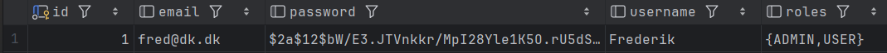

#Roles not valid.
While implementing token-based authentication in my security layer, I encountered an interesting issue that highlighted my debugging approach as a programmer.

I attempted to call a restricted function that was designed to be accessible only to users with the ADMIN role.

The following crash log was produced:

```json
{
  "title": "User was not authorized with roles: [ADMINUSER]. Needed roles are: [ADMIN]",
  "status": 403,
  "type": "https://javalin.io/documentation#forbiddenresponse",
  "details": {}
}
```
From the error, the issue is immediately apparent. The message indicates that the method requires an `ADMIN` role, while the current role is `ADMINUSER`.

This suggests a problem in how roles are handled when multiple roles are assigned within the system.

To approach this systematically, we can consider two possible sources of the issue: either the data is being stored incorrectly in the database, or it is being retrieved incorrectly.

We will begin by examining how role information is stored in the database.



We can clearly see that the information for user 1 is being saved correctly as `{ADMIN,USER}`.

This allows us to rule out errors during the data persistence stage. Therefore, the issue must occur when retrieving information from the database.

So, where should we begin? We know that token creation is handled exclusively by the `Login` method, making it the logical starting point for our investigation.

```java
    public void login(Context ctx) {
        UserDTO user = ctx.bodyAsClass(UserDTO.class);
        try{
            User userEntity = userDAO.getVerifiedUser(user.getEmail(), user.getPassword());
            String token = createToken(new UserDTO(userEntity.getUsername(),userEntity.getPassword(),userEntity.getRolesAsString(),userEntity.getEmail()));
            ObjectNode node = objectMapper.createObjectNode();

            ctx.status(200).json(node
                    .put("token",token)
                    .put("username",userEntity.getUsername()));
        } catch (ValidationException ex) {
            throw new ApiException(401, ex.getMessage());
        }
    }
```
At this point, there are a couple of places where the error could be occurring.

We can see that the `createToken` method accepts a `UserDTO` as a parameter, so this is a good place to begin our investigation.

Within the `UserDTO`, roles are stored in the set `private Set<String> roles = new HashSet<>();`, which appears to be correct.

Since everything looks fine here, this narrows our focus to a single remaining candidate: `getRolesAsString().`

```java
    public String getRolesAsString(){

        String rolesAsString = "";
        for (Roles r : roles){
            String temp = r.toString();
            rolesAsString += temp;
        }
        return rolesAsString;
    }
```

And there it is—we’ve identified the issue. This method concatenates roles when converting them to Strings, which results in the assigned role appearing as `ADMINUSER`.

To fix this, we need to separate each role with a "," during the conversion process.

```java
public String getRolesAsString(){

        String rolesAsString = "";
        for (Roles r : roles){
            String temp = r.toString();
            rolesAsString += temp + ",";
        }
            rolesAsString = rolesAsString.substring(0, rolesAsString.length() - 1);
        return rolesAsString;
    }
```
With this change, the roles are now correctly formatted. We can verify this by calling the restricted endpoint.

The following is the response we receive:

```json
{
  "username": "Frederik Edvardsen",
  "email": "12345678",
  "roles": [
    "ADMIN,USER"
  ]
}
```

That’s how we, as developers, hunt down bugs—by systematically narrowing the search space until there’s nowhere left for the issue to hide.
It’s not guesswork; it’s a process of elimination, observation, and precision. Every clue matters, and every assumption gets tested.
In the end, bugs aren’t magic—they’re just waiting to be exposed by a methodical approach and a bit of persistence.

